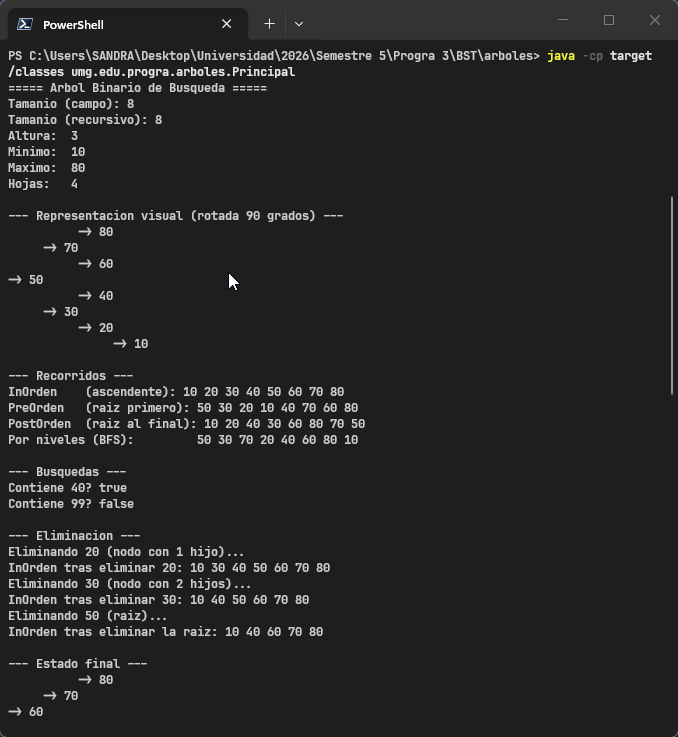
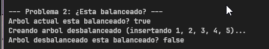
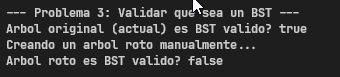
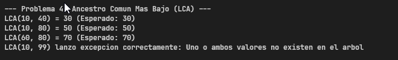
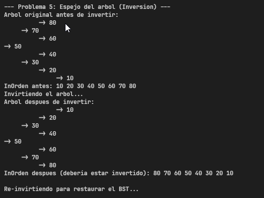
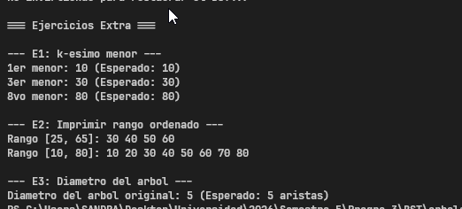

# Tarea: Árbol Binario de Búsqueda (BST) en Java
---

## 1. Descripción del Proyecto

Este repositorio contiene la implementación manual de un Árbol Binario de Búsqueda (BST) en Java, desarrollado de forma nativa sin hacer uso de `java.util` u otras dependencias externas. Se incluye el código base para la inserción, eliminación básica, búsquedas y recorridos, así como la resolución de 5 problemas obligatorios y 4 ejercicios extra para ampliar y robustecer el funcionamiento de la estructura de datos.

---

## 2. Instrucciones de Compilación y Ejecución

El proyecto está gestionado con Maven. Asegúrate de tener instalado Java 8 o superior y Maven en tu sistema.

### Compilar el Proyecto
Desde la carpeta raíz del proyecto (`arboles/`), ejecuta:
```bash
mvn compile
```

### Ejecutar el Proyecto
Para ver la demostración completa de todas las funcionalidades y pruebas automáticas:
```bash
java -cp target/classes umg.edu.progra.arboles.Principal
```

### Ejecutar Construyendo un Árbol desde Consola (Extra E4)
Puedes pasar una lista de enteros como argumentos para construir un BST dinámicamente y evaluar su estado:
```bash
java -cp target/classes umg.edu.progra.arboles.Principal 50 25 75 12 37 62 87
```

---

## 3. Problemas Obligatorios Resueltos

A continuación se detalla cada uno de los métodos implementados:

### Problema 1 — Contar nodos recursivamente
*   **Método:** `public int contarNodos()`
*   **Explicación:** Calcula la cantidad total de nodos en el árbol mediante una función recursiva pura. No utiliza el atributo de clase `tamanio`.
*   **Ejemplo de Entrada/Salida:**
    *   *Entrada:* Árbol con elementos `[50, 30, 70, 20, 40, 60, 80, 10]`
    *   *Salida:* `Tamanio (recursivo): 8`
*   **Evidencia visual (Captura):**
    

### Problema 2 — ¿Está balanceado?
*   **Método:** `public boolean esBalanceado()`
*   **Explicación:** Verifica si la diferencia de altura entre el subárbol izquierdo y el derecho para **cada nodo** del árbol es menor o igual a 1.
*   **Ejemplo de Entrada/Salida:**
    *   *Entrada:* Árbol balanceado original
    *   *Salida:* `Arbol actual esta balanceado? true`
    *   *Entrada:* Árbol con elementos insertados en orden secuencial `[1, 2, 3, 4, 5]`
    *   *Salida:* `Arbol desbalanceado esta balanceado? false`
*   **Evidencia visual (Captura):**
    

### Problema 3 — Validar que sea un BST
*   **Método:** `public boolean esBSTValido()`
*   **Explicación:** Valida recursivamente si la propiedad fundamental del BST se cumple en todos los nodos (subárbol izquierdo `<` raíz `<` subárbol derecho). Para lograrlo se restringen los rangos admisibles de valores `(min, max)` en cada nivel del árbol.
*   **Ejemplo de Entrada/Salida:**
    *   *Entrada:* Árbol BST correcto
    *   *Salida:* `Arbol original (actual) es BST valido? true`
    *   *Entrada:* Árbol alterado manualmente colocando un nodo con valor `100` a la izquierda de la raíz `50`
    *   *Salida:* `Arbol roto es BST valido? false`
*   **Evidencia visual (Captura):**
    

### Problema 4 — Ancestro Común Más Bajo (LCA)
*   **Método:** `public int ancestroComunMasBajo(int a, int b)`
*   **Explicación:** Encuentra el nodo ancestro de menor jerarquía común para dos elementos dados en el BST. Si alguno de los valores `a` o `b` no pertenece al árbol, arroja una excepción `IllegalArgumentException`.
*   **Ejemplo de Entrada/Salida:**
    *   *Entrada:* `LCA(10, 40)` en el árbol original
    *   *Salida:* `30`
    *   *Entrada:* `LCA(10, 99)`
    *   *Salida:* `LCA(10, 99) lanzo excepcion correctamente: Uno o ambos valores no existen en el arbol`
*   **Evidencia visual (Captura):**
    

### Problema 5 — Espejo del árbol (Inversión)
*   **Método:** `public void invertir()`
*   **Explicación:** Intercambia las referencias izquierda y derecha de todos los nodos del árbol de forma recursiva, creando una imagen espejo.
*   **Ejemplo de Entrada/Salida:**
    *   *InOrden Original:* `10 20 30 40 50 60 70 80`
    *   *InOrden Invertido:* `80 70 60 50 40 30 20 10`
*   **Evidencia visual (Captura):**
    

---

## 4. Ejercicios Extra Resueltos

### E1 — K-ésimo Menor
*   **Método:** `public int kEsimoMenor(int k)`
*   **Explicación:** Retorna el k-ésimo elemento más pequeño dentro del BST haciendo un recorrido InOrden y deteniéndose al llegar a la posición `k`.
*   **Ejemplo de Entrada/Salida:**
    *   *Entrada:* `k = 3`
    *   *Salida:* `3er menor: 30`

### E2 — Imprimir Rango Ordenado
*   **Método:** `public void imprimirRangoOrdenado(int min, int max)`
*   **Explicación:** Imprime de manera ordenada y ascendente los valores contenidos en el rango `[min, max]`. Optimiza la búsqueda podando/descartando subárboles completos cuyos rangos queden fuera de los parámetros solicitados.
*   **Ejemplo de Entrada/Salida:**
    *   *Entrada:* `imprimirRangoOrdenado(25, 65)`
    *   *Salida:* `30 40 50 60`

### E3 — Diámetro
*   **Método:** `public int diametro()`
*   **Explicación:** Retorna el camino más largo (en número de aristas) entre dos nodos hojas cualesquiera del BST.
*   **Ejemplo de Entrada/Salida:**
    *   *Salida:* `Diametro del arbol original: 5`

### E4 — Construcción de BST desde argumentos de consola
*   **Explicación:** La clase `Principal` fue extendida para recibir parámetros en `args`. Si existen, genera e imprime un BST dinámico, mostrándolo gráficamente en consola y verificando sus propiedades.
*   **Evidencia visual de los Extras (Captura):**
    
